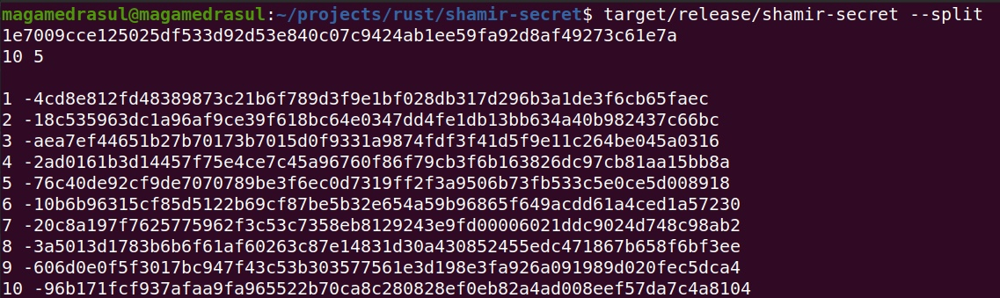
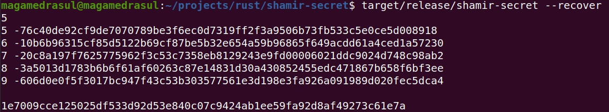

### Разделение и восстановление секрета по схеме Шамира ###
***Программа, разделяет секретную строку в hex формате длиной 256 bit (например, приватный ключ ECDSA secp256k1) на N частей по схеме Шамира и восстанавливает его при предъявлении любых T частей.***

#### Клонирование репозитория и запуск ####
 ```bash
git clone https://github.com/Curryrasul/shamir-secret
cd shamir-secret/
```

**Для сборки проекта введите:**
```bash
cargo build --release
```

**Запуск после сборки:**
```bash
./target/release/shamir-secret --split
```

```bash
./target/release/shamir-secret --recover
```

**Пример запуска в режиме split:** 

**Вывод 10 "частей" ключа, из которых 5 достаточно для восстановления**

**Пример запуска в режиме recover:** 

**Ввод 5 "частей" - ключ восстановлен**